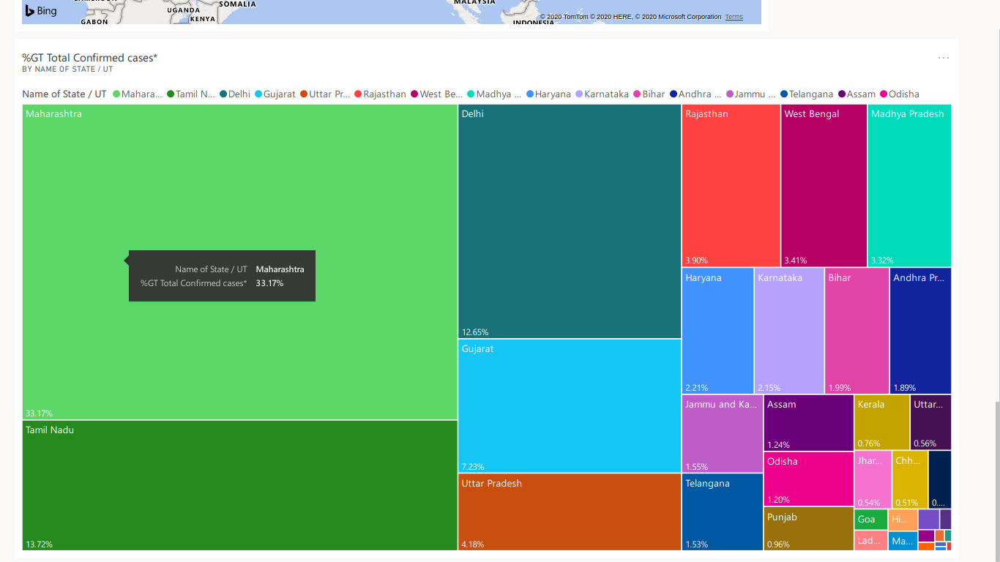

# Corona-Virus-Analytics-Tracking
Corona virus Live update scrapping from MoHFW.(Ministry of Health and Family Welfare in india))
https://www.mohfw.gov.in/ is the official website of Ministry of Health and Family Welfare (MoHFH) Government of India.
# COVID-19 Statewise Status
Data scrapping using selenium in python.show the data statewise list Death,Cured,Active etc.
# Methodlogy
1.scrap the data  
2.perfrom preprocessing  
3.clean the data  
4.remove noisy data  
5.create csv file  
6.take latitude and longitude from http://api.openweathermap.org using state name.
# Corona_data.py {scrap data,clean,coordinate,csv}
using this first scrap all data from live website which update by goverment of india. 
it is all store in covid19_data.csv
# Covid19_virus_Analytics.py 
by using this perform all preprocessing operation and using Folium Library visualize the data on the Google map.
it is all store in covid19_map_data.csv
# Corona-Virus map using Folium 

# Corona visualization in india in top 5 states

# Corona Discharged visualization in india in top 5 states

# Corona Analytics with Power BI

Dashboard link:https://app.powerbi.com/groups/me/dashboards/e6bbde2b-c8c9-4a4d-90dd-26c11b272aa3?ctid=9a99984a-d810-43f1-b992-dd5f00d2f333
